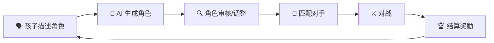
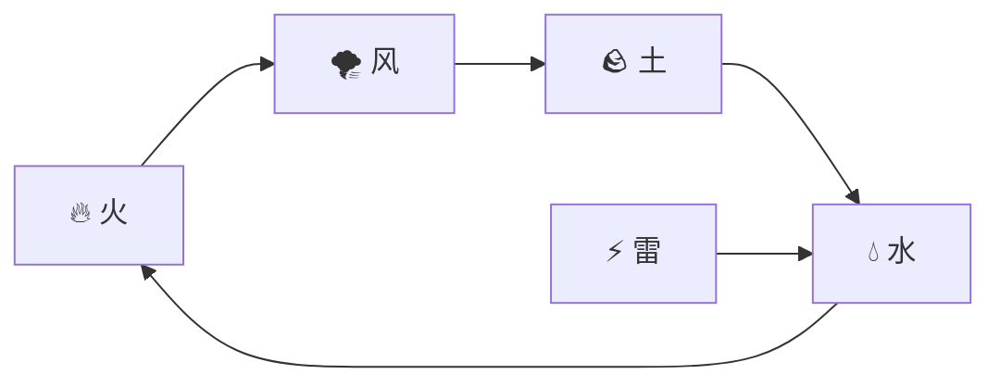

# 游戏设计文档 (Game Design Document)

**项目名称**：Little Buddy / 小伙伴  
**平台**：iOS（iPhone & iPad），未来扩展至 Android  
**目标用户**：3–10 岁儿童（家长辅助）  
**游戏类型**：AI 驱动 + 角色扮演 + 对战  
**版本**：v0.1（草稿）  
**日期**：2026-02-28

---

## 1. 游戏概述

Little Buddy 是一款让孩子通过**自然语言**描述来创建专属角色并进行对战的 iOS 游戏。孩子只需告诉 AI："我想要一个会喷火的蓝色机器人，它的拳头是铁锤！"，AI 便会将这段描述转化为具有明确属性和技能的游戏角色。两名玩家各自创建角色后，即可展开实时或异步对战。

**核心价值主张**：
- 🧠 激发想象力与创造力
- 🗣️ 练习语言表达与描述能力
- 🤝 社交对战，家长与孩子互动

---

## 2. 核心游戏循环

### 2.1 角色创建流程

1. 孩子打开 App，点击"创建新伙伴"
2. AI 助手（卡通形象）引导孩子描述：
   - "你的伙伴长什么样？"
   - "它有什么特殊能力？"
   - "它的弱点是什么？"
3. AI 根据对话内容，通过 [角色 DSL](CHARACTER_DSL.md) 生成角色配置
4. App 渲染角色形象（初期：卡通/火柴人风格）
5. 孩子确认或继续调整

### 2.2 对战流程

1. 玩家选择已创建的角色进入匹配
2. 匹配另一名玩家（或 AI 对手）
3. 进入对战场景：
   - 回合制：每回合选择技能
   - 技能效果由角色 DSL 属性决定
4. 对战结束，结算经验值和奖励

---

## 3. 角色系统

### 3.1 角色属性

每个角色由以下核心属性构成（详见 [CHARACTER_DSL.md](CHARACTER_DSL.md)）：

| 属性类别 | 属性名 | 说明 |
|---------|--------|------|
| 基础属性 | `hp` | 生命值 |
| 基础属性 | `attack` | 攻击力 |
| 基础属性 | `defense` | 防御力 |
| 基础属性 | `speed` | 速度（决定先手） |
| 元素属性 | `element` | 火/水/风/土/雷/无 |
| 外形 | `appearance` | AI 生成的外形描述 |
| 技能 | `skills[]` | 最多 4 个技能 |
| 性格 | `personality` | 影响 AI 对战行为 |

### 3.2 技能系统

每个角色最多拥有 **4 个技能**，每个技能包含：

- `name`：技能名称（由孩子描述/AI 命名）
- `type`：攻击 / 防御 / 支援 / 特殊
- `power`：技能威力（1–100）
- `element`：技能元素属性
- `cooldown`：冷却回合数
- `effect`：特殊效果（中毒、眩晕、治疗等）

### 3.3 角色平衡

为避免无限制的"我的角色无敌"，系统采用**属性点总量上限**机制：

- 每个角色初始拥有 **100 属性点**
- 玩家通过游玩获得额外属性点
- 付费扩展包可解锁新技能类型，但不直接增加属性点

---

## 4. 对战系统

### 4.1 对战模式

| 模式 | 说明 |
|------|------|
| 好友对战 | 通过房间码与好友对战 |
| 随机匹配 | 与相近等级玩家匹配 |
| AI 对战 | 与 AI 操控的角色练习 |
| 家长模式 | 家长创建角色与孩子对战 |

### 4.2 回合制规则

1. 双方角色各拥有 HP
2. 按速度值决定先手（速度高者先行动）
3. 每回合行动方选择一个技能使用
4. 技能命中后，根据攻/防/元素克制计算伤害
5. HP 归零者判负

### 4.3 元素克制关系

> ⭐ 无元素：无克制/被克制关系

---

## 5. 关卡与进度系统

### 5.1 角色成长

- 对战后获得经验值
- 升级后获得属性点（可分配给基础属性）
- 特定等级解锁新技能槽位

### 5.2 成就系统

- "首次创建角色"
- "第一场胜利"
- "连胜 5 场"
- "描述超过 50 个词创建角色"（鼓励表达）

---

## 6. 社交与分享

- 角色可生成**分享卡片**（带角色形象 + 属性概览）
- 支持导出为**对战实体卡**（二维码 / NFC 标签）
- 未来支持 **3D 打印文件导出**（.STL 格式）

---

## 7. 付费与商业化

### 7.1 免费内容

- 创建角色（每账号最多 3 个角色）
- 基础对战功能
- 基础技能类型（约 20 种）

### 7.2 付费内容

| 内容 | 类型 | 说明 |
|------|------|------|
| 角色槽位扩展 | 一次性购买 | 解锁更多角色槽位 |
| 元素扩展包 | 扩展包 | 解锁新元素及对应技能类型 |
| 皮肤主题包 | 扩展包 | 改变 App 和角色渲染风格 |
| 实体卡片 | 实物商品 | 印刷角色对战卡 |
| 3D 打印文件 | 数字商品 | 角色 3D 模型文件 |

### 7.3 扩展包设计原则

> 技术上等于是卖扩展的 DSL —— 付费解锁新的 DSL 元素，而不是直接提升战斗力

- 扩展包扩充 DSL 中可用的技能类型、元素、效果词汇
- 不付费不影响基础游戏体验
- 鼓励孩子描述更丰富的角色（而非靠氪金赢）

---

## 8. UI/UX 设计原则

- **简洁友好**：大字体、大按钮、卡通图标
- **语音优先**：支持语音输入（适合低龄儿童）
- **家长控制**：内购需要家长验证（Face ID / 密码）
- **无障碍**：支持 iOS 无障碍功能（VoiceOver 等）
- **色彩明亮**：高对比度，适合儿童视觉

---

## 9. 未来规划

- Android 版本
- 智能硬件对战设备（NFC 实体卡对战台）
- 多人联赛模式
- AI 生成动画对战演示
- 家长数据看板（孩子的描述词汇量、创造力分析）
