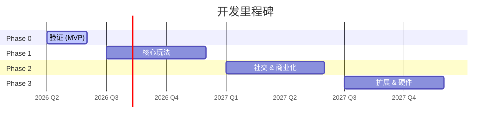

# 开发路线图 (Development Roadmap)

**项目**：Little Buddy / 小伙伴  
**日期**：2026-02-28（最近更新）  
**版本**：v0.2

---

## 里程碑总览

> ⚠️ 项目于 2026-02-28 完成初始化（设计文档、代码框架、核心 DSL 和战斗引擎原型）。原计划 Phase 0 起始于 Q1，但实际编码从 Q1 末启动，因此各阶段时间线整体后移。

---

## Phase 0 — 概念验证 (MVP)

**目标**：验证核心假设——孩子是否喜欢并能够用语言描述角色？

**时间**：2026 Q2（约 6–8 周）

### 0.1 技术原型

- [x] 搭建基础 iOS 项目结构（SwiftUI + Swift Package Manager）
- [x] 实现最简 DSL 解析器（角色属性、技能、元素系统、DSL 验证器）
- [x] 集成 LLM API（ChatAnywhere / OpenAI 兼容），实现自然语言 → DSL 转换（含本地关键词匹配回退）
- [x] 使用 SpriteKit 渲染简单角色形象（火柴人/色块）

### 0.2 最简对战系统

- [x] 本地回合制对战引擎核心逻辑（伤害计算、元素克制、先手判定）
- [x] 最简对战 UI：选择技能 → 显示伤害 → 胜负判定
- [x] 支持 2 台设备本地传屏（Pass-and-Play 模式）

### 0.3 用户测试

- [ ] 招募 5–10 组家庭进行用户测试
- [ ] 收集反馈：孩子是否能理解流程？描述是否丰富？
- [ ] 验证关键假设后决定是否继续

### Phase 0 交付物

- 可演示的 iOS 原型（TestFlight）
- 用户测试报告
- 技术可行性评估

---

## Phase 1 — 核心玩法完善

**前置条件**：Phase 0 用户测试正向

**时间**：2026 Q3–Q4（约 12–16 周）

### 1.1 角色创建完善

- [ ] 引导式对话 UI（AI 助手卡通形象）
- [ ] 支持语音输入（Speech Framework）
- [ ] 角色形象 AI 生成（集成图片生成 API）
- [ ] 角色预览与调整功能
- [ ] 本地角色存储（SwiftData）

### 1.2 完整 DSL 系统

- [ ] 实现完整 CHARACTER_DSL v1.0 规范
- [ ] DSL 验证器（属性点约束检查）
- [ ] 基础扩展包枚举（所有基础包元素）
- [ ] DSL 版本迁移机制

### 1.3 联网对战

- [ ] 用户账号系统（Apple Sign-In）
- [ ] 后端部署（AI 服务 + 对战服务）
- [ ] WebSocket 实时对战
- [ ] 随机匹配系统
- [ ] 好友对战（分享房间码）

### 1.4 游戏体验

- [ ] 完整对战动画（SpriteKit）
- [ ] 音效和背景音乐
- [ ] 经验值和升级系统
- [ ] 基础成就系统

### Phase 1 交付物

- App Store 正式上线（免费版本）
- 后端服务部署完成
- 用户留存分析上线

---

## Phase 2 — 社交与商业化

**前置条件**：Phase 1 DAU 达到目标值

**时间**：2027 Q1–Q2（约 12 周）

### 2.1 商业化

- [ ] StoreKit 2 集成（内购）
- [ ] 元素扩展包（自然之力、光暗等）
- [ ] 角色槽位扩展购买
- [ ] 皮肤主题包
- [ ] 订阅制考虑（"小伙伴会员"）

### 2.2 实体周边

- [ ] 角色卡片设计系统（PDF 导出）
- [ ] 对接第三方印刷服务（按需印刷）
- [ ] NFC/二维码卡片扫描识别（ARKit）

### 2.3 社交功能

- [ ] 角色分享卡片（社交媒体分享）
- [ ] 排行榜（按等级、对战胜率）
- [ ] 家长数据看板（孩子的词汇量、创造力报告）
- [ ] 好友系统

### Phase 2 交付物

- 付费功能上线
- 实体卡片购买流程
- 社交分享功能

---

## Phase 3 — 扩展与硬件

**前置条件**：商业化验证成功，收入可支撑研发

**时间**：2027 Q3+，具体时间待定

### 3.1 Android 版本

- [ ] 评估是否迁移至 Unity/Godot（跨平台引擎）
- [ ] Android 版本开发与上线

### 3.2 智能硬件

- [ ] NFC 实体对战卡设计与生产
- [ ] 专属对战台（可扫描实体卡，显示 AR 对战）
- [ ] 与硬件厂商合作谈判

### 3.3 3D 打印

- [ ] 3D 角色建模生成（基于 DSL 自动生成 .STL）
- [ ] 对接 3D 打印服务平台
- [ ] 支持玩家下载并自行打印

### 3.4 AI 升级

- [ ] 对战动画 AI 生成（角色专属对战演示视频）
- [ ] 更精细的 AI 角色形象生成
- [ ] 本地推理（减少延迟，支持更好的离线体验）

---

## 风险与假设

| 风险 | 可能性 | 影响 | 缓解措施 |
|------|--------|------|---------|
| LLM API 成本过高 | 中 | 高 | 限制每日生成次数，考虑本地小模型 |
| 儿童语言理解准确率低 | 中 | 高 | 优化 Prompt，增加引导式对话 |
| AI 生成内容安全 | 中 | 极高 | 多层内容过滤，人工审核机制 |
| 家长不愿意让孩子付费 | 低 | 中 | 免费功能足够有趣，付费是增值 |
| 竞品出现（大厂抄袭） | 高 | 中 | 快速迭代，建立品牌和用户忠诚度 |
| iOS 审核被拒 | 低 | 高 | 提前研究儿童类 App 审核规范（COPPA） |

---

## 当前状态

- [x] 项目概念确认
- [x] 游戏设计文档（GDD）初稿
- [x] 技术架构文档初稿
- [x] 角色 DSL 规范初稿
- [x] iOS 项目框架搭建（SwiftUI + Swift Package Manager）
- [x] 角色 DSL 模型实现（Character、Skill、Element、DSLValidator）
- [x] 战斗引擎核心逻辑实现（伤害计算、元素克制、先手判定）
- [x] 角色创建 UI 原型（文本输入 + 本地关键词匹配生成）
- [x] 单元测试覆盖（DSL 验证、战斗引擎共 23 个测试用例）
- [x] LLM API 集成（ChatAnywhere / OpenAI 兼容，含本地回退）
- [x] SpriteKit 角色渲染（火柴人/色块风格）
- [x] Pass-and-Play 本地双人对战模式
- [ ] Phase 0 用户测试
