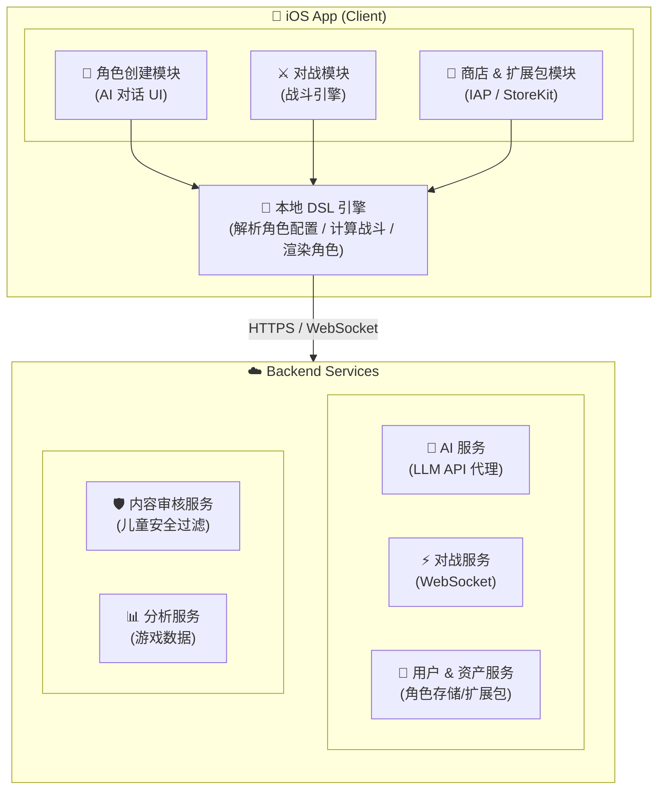
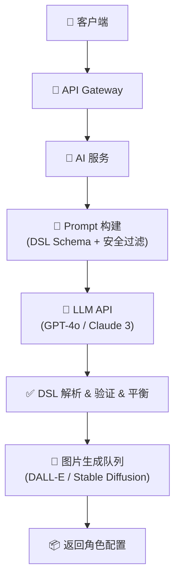

# 技术架构文档 (Technical Architecture)

**版本**：v0.1  
**日期**：2026-02-28  
**平台**：iOS（优先），未来扩展 Android

---

## 1. 系统架构总览



---

## 2. 客户端技术栈 (iOS)

| 层次 | 技术选型 | 说明 |
|------|---------|------|
| UI 框架 | **SwiftUI** | 现代声明式 UI，支持 iOS 17+ |
| 游戏渲染 | **SpriteKit** | 2D 游戏渲染，角色动画 |
| 3D（未来） | **SceneKit / RealityKit** | 3D 角色渲染 |
| 网络层 | **URLSession + async/await** | 与后端 API 通信 |
| 实时通信 | **WebSocket (URLSessionWebSocketTask)** | 实时对战 |
| 本地存储 | **SwiftData** | 本地角色存储 |
| 语音输入 | **Speech Framework** | 儿童语音转文字 |
| 内购 | **StoreKit 2** | 扩展包、一次性购买 |
| 推送通知 | **UserNotifications** | 对战邀请通知 |

### 2.1 iOS 项目结构

```
LittleBuddy/
├── Package.swift                        # Swift Package Manager 配置
├── Sources/
│   └── LittleBuddy/
│       ├── App/
│       │   ├── LittleBuddyApp.swift       # App 入口（@main）
│       │   └── ContentView.swift
│       ├── Features/
│       │   ├── CharacterCreation/         # 角色创建功能
│       │   │   ├── Views/
│       │   │   │   ├── CharacterCreationView.swift
│       │   │   │   └── CharacterPreviewView.swift
│       │   │   ├── ViewModels/
│       │   │   │   └── CharacterCreationViewModel.swift
│       │   │   └── Services/
│       │   │       └── AICharacterService.swift
│       │   ├── Battle/                    # 对战功能
│       │   │   ├── Views/
│       │   │   │   ├── BattleView.swift
│       │   │   │   └── SkillSelectionView.swift
│       │   │   ├── ViewModels/
│       │   │   │   └── BattleViewModel.swift
│       │   │   └── Engine/
│       │   │       └── BattleEngine.swift
│       │   ├── Store/                     # 商店功能
│       │   │   ├── Views/
│       │   │   │   └── StoreView.swift
│       │   │   └── Services/
│       │   │       └── StoreKitService.swift
│       │   └── Profile/                   # 用户资料
│       │       └── Views/
│       │           └── ProfileView.swift
│       ├── Core/
│       │   ├── DSL/                       # 角色 DSL 模型
│       │   │   ├── Character.swift
│       │   │   ├── Skill.swift
│       │   │   ├── Element.swift
│       │   │   └── DSLValidator.swift
│       │   ├── Network/
│       │   │   ├── APIClient.swift
│       │   │   └── WebSocketClient.swift
│       │   ├── Storage/
│       │   │   └── LocalStorage.swift
│       │   └── Extensions/
│       │       └── Color+Extensions.swift
│       └── Resources/
│           ├── Assets.xcassets/
│           ├── Localizations/
│           │   ├── zh-Hans.lproj/
│           │   └── en.lproj/
│           └── Info.plist
└── Sources/
    └── LittleBuddyTests/
        ├── DSLTests/
        │   └── CharacterDSLTests.swift
        └── BattleEngineTests/
            └── BattleEngineTests.swift
```

---

## 3. 后端服务架构

### 3.1 技术选型

| 服务 | 技术 | 说明 |
|------|------|------|
| API 网关 | **Kong / AWS API Gateway** | 统一入口、鉴权、限流 |
| AI 服务 | **Python FastAPI** | LLM API 代理、Prompt 工程 |
| 对战服务 | **Go / WebSocket** | 低延迟实时对战 |
| 用户服务 | **Node.js** | 用户管理、角色存储 |
| 内容审核 | **AWS Rekognition + 自定义过滤** | 儿童安全内容过滤 |
| 数据库 | **PostgreSQL** | 用户、角色数据 |
| 缓存 | **Redis** | 对战状态、排行榜 |
| 文件存储 | **AWS S3** | 角色图片、3D 文件 |
| 消息队列 | **AWS SQS** | 异步任务（图片生成等） |

### 3.2 AI 角色生成流程



---

## 4. 关键接口设计 (API)

### 4.1 角色创建 API

```http
POST /api/v1/characters/generate
Authorization: Bearer {token}
Content-Type: application/json

{
  "conversation": [
    {"role": "assistant", "content": "你的伙伴长什么样？"},
    {"role": "user",      "content": "一个蓝色的机器人，拳头是铁锤"},
    {"role": "assistant", "content": "它有什么特殊能力？"},
    {"role": "user",      "content": "会从眼睛喷火"}
  ],
  "extension_packs": ["base"]
}
```

响应：角色 DSL JSON（见 [CHARACTER_DSL.md](CHARACTER_DSL.md)）

### 4.2 对战匹配 API

```http
POST /api/v1/battles/match
Authorization: Bearer {token}
Content-Type: application/json

{
  "character_id": "uuid",
  "mode": "random" // "friend" | "random" | "ai"
}
```

### 4.3 WebSocket 对战协议

```
// 连接
ws://server/battles/{battle_id}

// 客户端 → 服务端
{"action": "use_skill", "skill_id": "skill-uuid"}

// 服务端 → 客户端
{"event": "turn_result", "damage": 40, "effect": "burn", "next_turn": "player"}
{"event": "battle_end", "winner": "player", "exp_gained": 50}
```

---

## 5. 安全与隐私

### 5.1 儿童安全 (COPPA / 中国 PIPL)

- 所有 AI 生成内容经过儿童安全内容过滤
- 用户输入的自然语言不包含敏感信息时才发送至 AI 服务
- 13 岁以下用户需要家长验证（账号注册时）
- 不收集儿童的个人识别信息
- 语音数据在设备端转换为文字后丢弃，不上传原始音频

### 5.2 API 安全

- JWT Token 鉴权（短期有效，自动刷新）
- API 速率限制（防止滥用 AI 接口）
- 所有请求通过 HTTPS

---

## 6. Android 扩展计划

当 iOS 版本稳定后，按以下策略扩展到 Android：

| 层次 | 方案 |
|------|------|
| UI | Jetpack Compose |
| 游戏渲染 | 考虑迁移至 **Unity** 或 **Godot**（跨平台） |
| 后端 | 完全复用，无需改动 |
| DSL | 完全复用 |

> 💡 **关键决策点**：如果 iOS 版本验证成功后，建议评估是否迁移至跨平台引擎（Unity/Godot），以降低 Android 适配成本。

---

## 7. 性能目标

| 指标 | 目标 |
|------|------|
| 角色生成延迟 | < 5 秒（含 AI 响应） |
| 对战操作延迟 | < 200ms |
| App 冷启动时间 | < 2 秒 |
| 离线支持 | 本地角色查看、AI 对战 |
